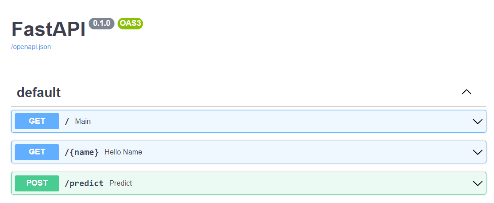
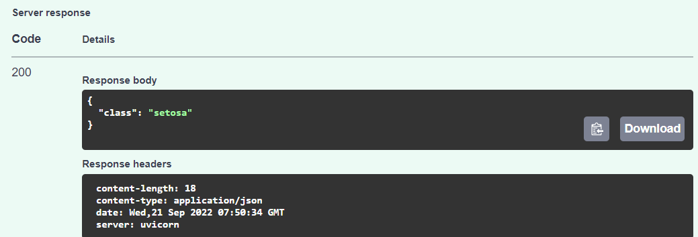

# Overview
The repository shows you an end to end practice from how to create python api, build as docker file, push to Azure Container Registry, make a helm chart, and deploy to Azure Arc with GitOps.
The predict-flower is an api made by fastapi and gaussianNb.

# Prerequisites
1. Docker  
2. On-premise Kubernetes  
3. Azure Subscription  
4. Azure Container Registry
5. Kubernetes - Azure-Arc  

# Build code
```
docker build -t <acr-login-server>/python-api/predict-flower:<version> 
```
# Push to Azure Container Registry
```
$ az login --use-device-code
$ az acr login --name <acr-name> --password <acr-password> -u <acr-username>
$ docker build -t <acr-login-server>/python-api/predict-flower:<version> .
$ docker push <acr-login-server>/python-api/predict-flower
```


# Use Azure-Arc to deploy helm chart
Follow the instruction to connect on-premise Kubernetes cluster to an Azure-Arc and set GitOps.  
```
Git Repository: "https://github.com/anancola/predict-flower.git"  
Repository Type: "public"  
Add a Kustomization by path: "releases"  
```

# Validatation
```
$ kubectl get pods
$ kubectl port-forward predict-flower-#### 8000:8000
```
Open browser with the url 'http://localhost:8000/docs'.


Test the '/predict' api with following input. There will be an 200 response with class "setosa".
```
sepal_length: 5
sepal_width: 3
petal_length: 1
petal_width: 0.2
```


# Reference
[1] https://www.geeksforgeeks.org/deploying-ml-models-as-api-using-fastapi/  
[2] https://learn.microsoft.com/en-us/azure/azure-arc/kubernetes/quickstart-connect-cluster?tabs=azure-cli  
[3] https://learn.microsoft.com/en-us/azure/azure-arc/kubernetes/tutorial-use-gitops-flux2  
[4] https://github.com/Azure/gitops-flux2-kustomize-helm-mt  
